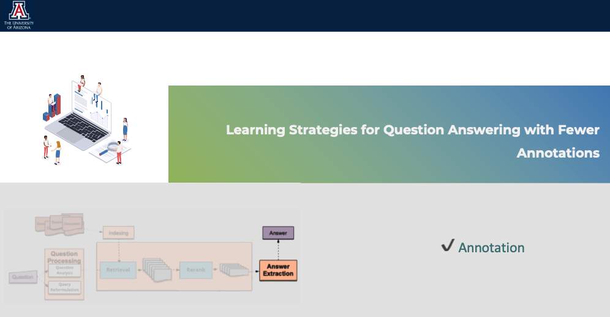

# TOWARDS THE ADVANCEMENT OF OPEN-DOMAIN TEXTUAL QUESTION ANSWERING METHODS

## Introduction
This repository contains my doctoral dissertation for the study of open-domain textual question answering (ODQA) methods. The study is aimed at exploring the challenges faced by ODQA systems, proposing solutions to improve the systems, and discussing new directions for future research. In particular, we investigate Multi-Hop QA (MHQA), a well-known complex QA task, which requires combining multiple supporting context pieces scattered in documents to infer the correct answer. Read more in the [dissertation paper](https://repository.arizona.edu/bitstream/handle/10150/667278/azu_etd_20139_sip1_m.pdf) and my [presentation](https://fan-luo.github.io/Presentation/TOWARDS%20THE%20ADVANCEMENT%20OF%20OPEN-DOMAINTEXTUAL%20QUESTION%20ANSWERING%20METHODS.html).

## Overview
The dissertation is divided into several chapters that cover the following topics:

- Introduction to open-domain QA
  1. A comprehensive review of existing ODQA systems
  2. Identification of challenges faced by ODQA systems
  3. What makes answering complex questions difficult 
- Question Analysis and Reformulation  
- Hybrid Evidence Retrieval and Reranking 
- Learning Strategies for Question Answering with Fewer Annotations 
- Conclusion and future directions for research

 
 

 
 &nbsp;&nbsp;&nbsp;&nbsp;&nbsp;&nbsp;&nbsp;&nbsp;&nbsp;&nbsp;

 

&nbsp;&nbsp;&nbsp;&nbsp;&nbsp;&nbsp;&nbsp;&nbsp;&nbsp;&nbsp;

 

## Requirements
It is recommended to have a PDF reader to view the document.

## Contributing
This repository is meant for archival purposes and no further contributions are expected.

## License
The contents of this repository are licensed under the [CC BY-NC-ND 4.0](https://creativecommons.org/licenses/by-nc-nd/4.0/) license.

## Contact
For any questions or comments regarding the contents of this repository, please contact the author at fanluo@arizona.edu.
