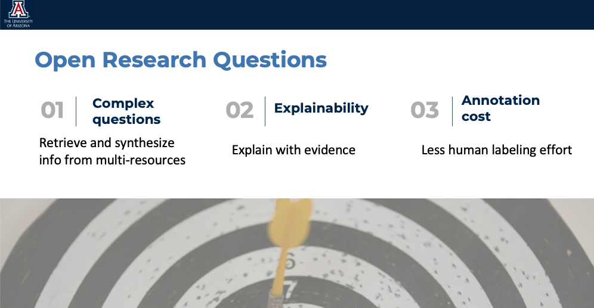

# TOWARDS THE ADVANCEMENT OF OPEN-DOMAIN TEXTUAL QUESTION ANSWERING METHODS

## Introduction
This repository hosts my doctoral dissertation titled "Towards the Advancement of Open-Domain Textual Question Answering Methods". The dissertation focuses on the field of Open-domain Question Answering (ODQA), which involves answering general domain questions using a large collection of texts, such as Wikipedia. The dissertation presents several innovative solutions aimed at addressing the challenges faced by ODQA systems and improving the performance. The research works presented in the dissertation include an unsupervised graph-based method for identifying bridge phrases for multi-hop questions, a hybrid solution for evidence re-ranking, and a deep active learning technique for improving the underlying reader model. The approaches presented in the dissertation are relevant for researchers, practitioners, and students in the field of Natural Language Processing (NLP) and ODQA, and can be easily integrated into modern ODQA systems.Read more in the [dissertation paper](https://repository.arizona.edu/bitstream/handle/10150/667278/azu_etd_20139_sip1_m.pdf) and my [presentation](https://fan-luo.github.io/Presentation/TOWARDS%20THE%20ADVANCEMENT%20OF%20OPEN-DOMAINTEXTUAL%20QUESTION%20ANSWERING%20METHODS.html).

## Overview
The dissertation is divided into several chapters that cover the following topics:

- Introduction to open-domain QA
  1. A comprehensive review of existing ODQA systems
  2. Identification of challenges faced by ODQA systems
  3. What makes answering complex questions difficult 
- Question Analysis and Reformulation  
- Hybrid Evidence Retrieval and Reranking 
- Learning Strategies for Question Answering with Fewer Annotations 
- Conclusion and future directions for research

 
 

 
 &nbsp;&nbsp;&nbsp;&nbsp;&nbsp;&nbsp;&nbsp;&nbsp;&nbsp;&nbsp;

 

&nbsp;&nbsp;&nbsp;&nbsp;&nbsp;&nbsp;&nbsp;&nbsp;&nbsp;&nbsp;

 

## Contributing
This repository is meant for archival purposes and no further contributions are expected.

## License
The contents of this repository are licensed under the [CC BY-NC-ND 4.0](https://creativecommons.org/licenses/by-nc-nd/4.0/) license.

## Contact
For any questions or comments regarding the contents of this repository, please contact the author at fanluo@arizona.edu.
